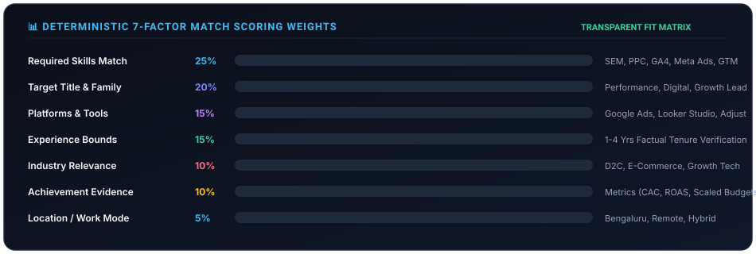

<div align="center">


# 🚀 ATS Resume Automation Engine

### *Autonomous Discovery, Deterministic Match Scoring, ATS Document Tailoring & Human Approval Queue*

[](https://www.python.org/)
[](https://github.com/dajmal942-source/ATS-Automation-Resume-Generator)
[](https://github.com/dajmal942-source/ATS-Automation-Resume-Generator)
[](https://github.com/dajmal942-source/ATS-Automation-Resume-Generator)
[](LICENSE)

<br/>

**Target Roles:** Performance Marketing Manager • Digital Marketing Specialist • Growth Marketing Lead • Paid Media (PPC / Social)  
**Target Seniority:** 1–4 Years Experience (Configurable)  
**Operating Principle:** Full automation for research, scoring, tailoring, validation, and review packaging — **Human-in-the-Loop** for final submission.

</div>

---

## ⚡ Visual Pipeline Overview

<div align="center">


</div>

```text
 ┌──────────────────────┐      ┌─────────────────────────┐      ┌───────────────────────────┐
 │ 1. INGESTION         │ ───► │ 2. PARSE & NORMALIZE    │ ───► │ 3. DETERMINISTIC SCORING  │
 │ URL / Text / Files   │      │ HTML Strip & Synonyms   │      │ 7-Factor Transparent Fit  │
 └──────────────────────┘      └─────────────────────────┘      └─────────────┬─────────────┘
                                                                              │
                                ┌─────────────────────────────────────────────┘
                                ▼
 ┌──────────────────────┐      ┌─────────────────────────┐      ┌───────────────────────────┐
 │ 4. RESUME TAILORING  │ ───► │ 5. ATS QUALITY GATE     │ ───► │ 6. HUMAN REVIEW QUEUE     │
 │ Markdown, DOCX, PDF  │      │ Strict Fact Audit       │      │ Review & Apply on Naukri  │
 └──────────────────────┘      └─────────────────────────┘      └───────────────────────────┘
```

---

## 🌟 Key Highlights

- 🟢 **Zero Setup Friction (Offline Deterministic Mode):** Runs instantly out of the box with zero external API keys required. An intelligent heuristic and rule-based engine generates complete resumes and scores immediately.
- 🎯 **Transparent 7-Factor Match Scoring:** No black-box guesses. Scores job postings across Title Fit (20%), Required Skills (25%), Platform/Tools (15%), Experience Bounds (15%), Industry Domain (10%), Location/Work Mode (5%), and Achievement Evidence (10%).
- 🛡️ **Strict Factuality Gate & Negative Constraints:** Automatically verifies all generated statements against candidate-provided facts. Enforces negative constraints (e.g., automatically rejects jobs requiring tools the candidate has never used).
- 📄 **Triple Document Outputs:** Compiles an editable Word document (`.docx`), a searchable ATS-optimized PDF (`.pdf`), and clean Markdown (`.md`) alongside a customized cover letter.
- 📊 **Supabase PostgreSQL Audit Tracking & Skill Gap Analytics:** Tracks application lifecycles from discovery to interview/offer and highlights recurring industry skill gaps.
- 🔑 **Drop-In Credentials Model:** Paste Google Gemini, OpenAI, Claude, or Naukri credentials at your convenience without altering code.

---

## 🚦 Step-by-Step Approach & Quickstart

Follow this numbered walkthrough to set up, test, and run your automation pipeline in minutes.

### ─── Step 0: Clone the Repository

```bash
git clone https://github.com/dajmal942-source/ATS-Automation-Resume-Generator.git
cd ATS-Automation-Resume-Generator
```

---

### ─── Step 1: Initialize Virtual Environment

```bash
# Windows (PowerShell)
python -m venv .venv
.\.venv\Scripts\activate

# Install pure-Python core dependencies
python -m pip install --upgrade pip
pip install -r requirements.txt
```

---

### ─── Step 2: Verify System & Credential Status

Run the built-in diagnostic checker:

```bash
python -m src.cli check-env
```

<details>
<summary><b>🔍 Sample Output Preview</b></summary>

```text
=================================================================
       ATS RESUME AUTOMATION - SYSTEM & CREDENTIAL STATUS       
=================================================================
Project Directory : C:\Users\user\Documents\ATS-Resume-Automation
Candidate Profile : data/candidate-profile.json (Found)
Database URL      : https://your-project-ref.supabase.co
Current LLM Mode  : OFFLINE
-----------------------------------------------------------------
CREDENTIALS STATUS:
  * Gemini Api            : [--] Not configured (Offline mode ready)
  * Openai Api            : [--] Not configured (Offline mode ready)
  * Anthropic Api         : [--] Not configured (Offline mode ready)
  * Naukri Api            : [--] Not configured (Offline mode ready)
  * Apify Api             : [--] Not configured (Offline mode ready)
  * Supabase Database     : [OK] Configured
-----------------------------------------------------------------
>> Status: Running in DETERMINISTIC OFFLINE MODE.
   The system functions immediately with deterministic rules & templates.
   To enable live LLM generation, paste your keys in '.env' at any time.
=================================================================
```
</details>

---

### ─── Step 3: Run Built-In Sample Test Jobs

Test the engine against realistic fixtures in `data/sample-jobs/`:

```bash
# Run single sample (Performance Marketing Manager)
python -m src.cli run-sample 01-perf-mktg-manager

# Run all 6 sample fixtures (high-fit, medium, low-fit, and conflicting roles)
python -m src.cli run-sample all
```

<details>
<summary><b>📊 Sample Execution Results</b></summary>

| Sample Job | Job Title | Fit Score | Outcome | Action Taken |
|---|---|:---:|:---:|---|
| `01-perf-mktg-manager.json` | Performance Marketing Manager | **95.1%** | `APPLY_REVIEW` | Generated Review Package (PDF, DOCX, MD, Cover Note) |
| `02-digital-mktg-lead.json` | Digital Marketing Specialist | **96.3%** | `APPLY_REVIEW` | Generated Review Package |
| `03-growth-mktg-specialist.json` | Growth Marketing Specialist | **95.9%** | `APPLY_REVIEW` | Generated Review Package |
| `04-irrelevant-role.json` | Senior Java Backend Engineer | **0.0%** | `REJECT` | Blocked & archived (< 50% threshold) |
| `05-missing-exp-role.json` | Digital Marketing Executive | **94.0%** | `APPLY_REVIEW` | Handled null bounds safely; generated package |
| `06-conflicting-role.json` | Lead Enterprise MarTech | **0.0%** | `REJECT` | **5 Negative Flags Detected** (SFMC, DV360, Marketo) |

</details>

---

### ─── Step 4: Ingest a Live Job

Ingest jobs from any source:

```bash
# Option A: Ingest via public / Naukri URL
python -m src.cli ingest --url "https://www.naukri.com/job-listings-performance-marketing..."

# Option B: Ingest via raw text paste
python -m src.cli ingest --text "Hiring Performance Marketing Specialist with 2+ years exp in Google Ads, Meta Ads, GA4, and GTM." --title "Performance Specialist" --company "Growth Labs"

# Option C: Ingest from an exported JSON or CSV file
python -m src.cli ingest --file "data/sample-jobs/01-perf-mktg-manager.json"
```

---

### ─── Step 5: Inspect Generated Review Packages

Every qualifying job (`>= 75%`) produces a dedicated review folder in `outputs/<application-id>/`:

```text
outputs/app-1eacd9c5-202610031815/
├── resume.pdf             # Clean, searchable, ATS-optimized PDF
├── resume.docx            # Single-column Microsoft Word document
├── resume.md              # ATS Markdown document
├── cover-note.md          # Tailored cover letter under 180 words
├── match-report.json      # Transparent score breakdown & matched keywords
├── validation-report.json # Factuality audit & quality gate results
└── change-log.md          # Change log of highlighted achievements & disclosed gaps
```

---

### ─── Step 6: Review & Apply (Human-in-the-Loop)

View your pending applications queue:

```bash
python -m src.cli review
```

Once you review your resume and apply manually on Naukri, record your decision:

```bash
python -m src.cli decide <application-id> apply --notes "Reviewed resume, submitted manually on Naukri"
```

---

### ─── Step 7: View Analytics & Skill Gap Intelligence

```bash
python -m src.cli report
```

<details>
<summary><b>📈 View Sample Report</b></summary>

```markdown
# ATS Resume Automation - Performance & Pipeline Report

- **Total Tracked Applications:** 5
- **Average Match Score:** 95.3/100
- **Strong Fit Jobs (>= 80%):** 5
- **Medium Fit Jobs (65-79%):** 0
- **Low Fit Jobs (< 65%):** 0

## Pipeline Status Breakdown
- **Approved For Manual Apply:** 1
- **Review Ready:** 4

## Common Missing Requirements (Skill Gaps)
- Requires 5+ yrs experience (Candidate has 2.5 yrs): appeared in 2 job descriptions
- Salesforce Marketing Cloud: appeared in 1 job descriptions (Negative constraint)
- Marketo: appeared in 1 job descriptions (Negative constraint)
- DV360: appeared in 1 job descriptions (Negative constraint)
```
</details>

---

## 🔐 How to Add Live API Credentials Later

When you are ready to enable live LLM generation or job board connectors, copy `.env.example` to `.env` and fill in your keys:

```dotenv
# Select provider: "gemini", "openai", "anthropic", or "offline"
LLM_PROVIDER=gemini

# Google Gemini (Recommended for Google Antigravity)
GEMINI_API_KEY=AIzaSy...
GEMINI_MODEL=gemini-1.5-pro

# OpenAI (Alternative)
OPENAI_API_KEY=sk-...
OPENAI_MODEL=gpt-4o

# Anthropic Claude (Alternative)
ANTHROPIC_API_KEY=sk-ant-...
ANTHROPIC_MODEL=claude-3-5-sonnet-20241022

# Naukri Integration (Official tokens if authorized)
NAUKRI_API_TOKEN=your_token_here
NAUKRI_CLIENT_ID=your_client_id_here
```

Restart or run `python -m src.cli check-env` to instantly activate live AI features.

---

## ⚖️ Match Scoring Matrix

<div align="center">



</div>

| Factor | Weight | Evaluation Logic |
|---|:---:|---|
| **Target Title & Family** | **20%** | Exact or semantic token match with Performance, Digital, or Growth Marketing. Irrelevant roles (e.g. Java, Backend) score **0%**. |
| **Required Skills Match** | **25%** | Cross-referenced with candidate verified skills & tools via synonym mapping (SEM, PPC, PMax, Paid Social). |
| **Platforms & Tools Match**| **15%** | Verifies Google Ads, Meta Ads Manager, GA4, GTM, Looker Studio, etc. |
| **Experience Bounds** | **15%** | Compares required years against candidate factual tenure (2.5 yrs). |
| **Industry Relevance** | **10%** | D2C, E-commerce, B2B SaaS, and Growth Tech focus. |
| **Location / Work Mode** | **5%** | Bengaluru, Mumbai, Delhi NCR, Remote, or Hybrid preferences. |
| **Achievement Evidence** | **10%** | Quantifiable metrics alignment (CAC reduction, ROAS scaling, server-side attribution). |

---

## 🧪 Automated Test Suite

Run the full suite of **16 unit, fixture, and end-to-end tests**:

```bash
pytest -v
```

```text
tests/test_e2e.py::test_full_pipeline_end_to_end PASSED                  [  6%]
tests/test_ingest.py::test_normalize_job_text_strips_html_and_excess_whitespace PASSED [ 12%]
tests/test_ingest.py::test_compute_content_hash_consistency PASSED       [ 18%]
tests/test_ingest.py::test_deduplicate_jobs PASSED                       [ 25%]
tests/test_ingest.py::test_ingest_from_json_file PASSED                  [ 31%]
tests/test_parser.py::test_job_parser_extracts_experience_and_tools PASSED [ 37%]
tests/test_parser.py::test_job_parser_handles_missing_experience_gracefully PASSED [ 43%]
tests/test_resume_gen.py::test_resume_tailoring_and_rendering PASSED     [ 50%]
tests/test_scoring.py::test_scorer_high_fit_role PASSED                  [ 56%]
tests/test_scoring.py::test_scorer_irrelevant_role_rejected PASSED       [ 62%]
tests/test_scoring.py::test_scorer_triggers_negative_constraints PASSED  [ 68%]
tests/test_scoring.py::test_scoring_weights_sum_to_one PASSED            [ 75%]
tests/test_tracker.py::test_tracker_db_crud PASSED                       [ 81%]
tests/test_validator.py::test_validator_passes_on_valid_resume PASSED    [ 87%]
tests/test_validator.py::test_validator_catches_unverified_employer PASSED [ 93%]
tests/test_validator.py::test_validator_catches_negative_constraint_violation PASSED [100%]

============================= 16 passed in 2.88s ==============================
```

---

## 🤖 GitHub Actions CI/CD

- **`test.yml`:** Automated tests, schema validation, and artifact builds on every commit.
- **`scheduled-discovery.yml`:** Scheduled daily discovery pipeline that automatically evaluates jobs and sends review packages to GitHub Artifacts.
- **`manual-tailor.yml`:** Manual dispatch allowing users to tailor a resume directly from GitHub Actions with a single URL.

---

## 📜 Compliance & Safety Rules

- 🚫 **No CAPTCHA Bypass or Scraping Behind Logins:** Protects account integrity.
- 🚫 **No Fabricated Facts:** Ensures candidate reputations remain trustworthy and auditable.
- 👤 **Human Approval Required:** No job is ever automatically submitted without candidate authorization.

---

<div align="center">
Developed with Google Antigravity • MIT License
</div>
